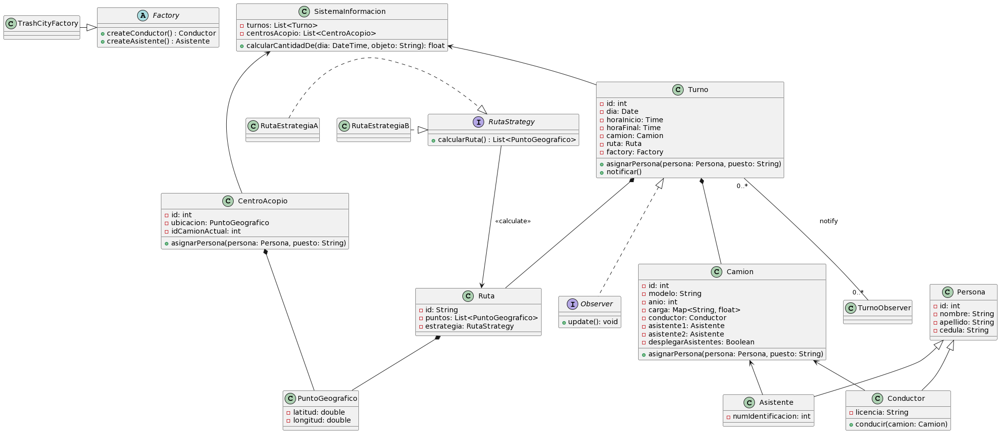

# Parcial-Final-POO
## Nombre: Daniel Enrique Martinez Medina

En este UML se han añadido los siguientes patrones de diseño:

- Patrón Observer: para que el sistema de información pueda estar al tanto de los cambios en los turnos y se actualice automáticamente cuando haya cambios en ellos.
- Patrón de Fábrica Abstracta: para facilitar la creación de objetos de tipo Conductor y Asistente sin depender de una implementación específica.
- Patrón Estrategia: para cambiar fácilmente entre diferentes algoritmos para calcular las rutas de recolección sin cambiar el código en la clase Ruta.

### EXPLICACION UML:
Se utiliza el patrón Observer para mejorar la comunicación entre los turnos y el sistema de información. El sistema de información puede subscribirse a los turnos y recibir actualizaciones automáticamente cuando haya cambios en ellos. Esto permite que la información se mantenga actualizada y sincronizada. Implementamos la clase TurnoObserver y Observer para lograr esto.

El patrón de Fábrica Abstracta simplifica la creación de objetos de tipo Conductor y Asistente, permitiendo cambiar fácilmente la implementación sin modificar la lógica del programa. Se crea la clase abstracta Factory y la subclase concreta TrashCityFactory que implementa la creación de los objetos Conductor y Asistente.

El patrón Estrategia ofrece una forma de cambiar fácilmente entre diferentes algoritmos para calcular las rutas de recolección sin modificar la clase Ruta. La clase RutaStrategy define un comportamiento que puede ser implementado por diferentes estrategias, como RutaEstrategiaA y RutaEstrategiaB.

### EXPLICACION IMPLENTACION:
En la implementación Python, se crean clases para representar todos los elementos del UML. Además, se define un menú iterativo que permite al usuario interactuar con el sistema y realizar consultas. El menú actualmente permite calcular la cantidad de un objeto en un día específico y salir del menú, pero se podrían añadir más opciones según las necesidades de la aplicación.

Las clases y métodos implementados en Python siguen el diseño propuesto en el UML, proporcionando la estructura y funcionalidad necesarias para gestionar la recolección y clasificación de residuos en TrashCity. La implementación en Python adoquín una base sólida sobre la cual se pueden agregar nuevas funcionalidades y mejoras según sea necesario.

### TESTS
Los test estan dentro de test/test.py
Para ejecutarlos se puede poner en la consola: pytest test/test.py